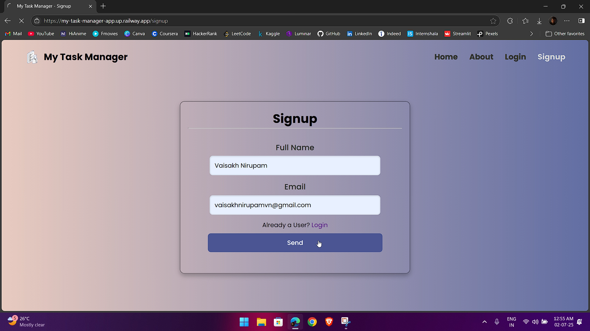
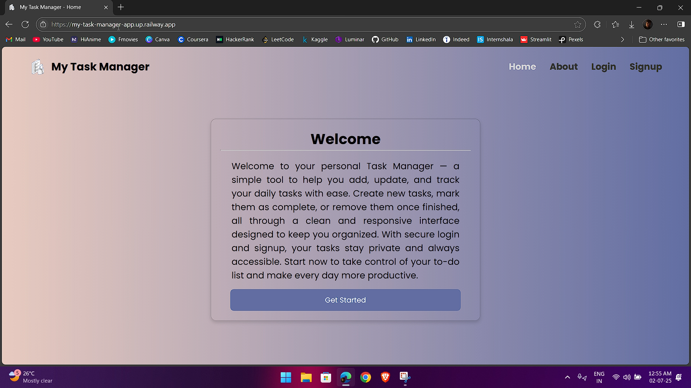
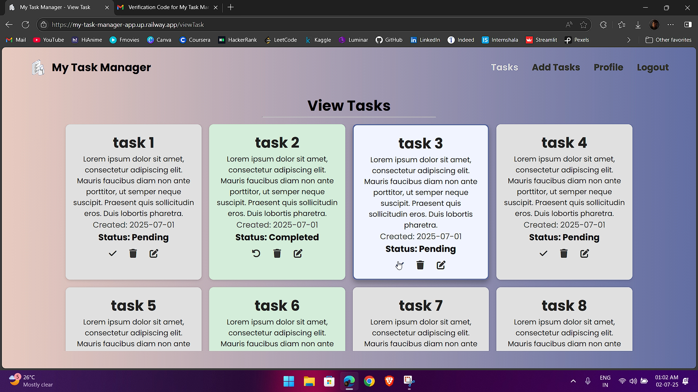

# ✅ My Task Manager

A secure, responsive **Flask** web application built to help users manage their daily tasks with ease. This project demonstrates modern user authentication with email-based OTP verification, combined with a clean and intuitive UI optimized for all screen sizes.

---

## 🌐 Live Demo

🔗 [Try the app now](https://my-task-manager-app.up.railway.app)

---

## 🚀 Features

- ✅ Email-based login with OTP verification
- 🔒 Secure user session management
- 📝 Add, edit, and delete daily tasks
- 📱 Fully responsive, mobile-friendly layout
- ⚡ Built with Flask’s routing and templating system
- 🌐 Deployed publicly to showcase end-to-end deployment

---

## ✅ Designed for:

- Individuals managing personal to-do lists
- Students tracking assignments
- Quick notes and task tracking anywhere, anytime

---

## 🛠️ Tech Stack

| Tool      | Description                             |
| --------- | --------------------------------------- |
| Flask     | Python web framework for routes & logic |
| MySQL     | Backend database                        |
| HTML/CSS  | Frontend structure & styling            |
| Bootstrap | Responsive, mobile-first UI framework   |
| SMTP      | For sending OTP verification emails     |

---

## 📦 Installation

1. **Clone the repository**:

```bash
git clone https://github.com/Vaisakh-Nirupam/Task_Manager.git
cd Task_Manager
```

2. **Create a virtual environment**:

```bash
python -m venv venv
source venv/Scripts/activate
```

3. **Install dependencies**:

```bash
pip install -r requirements.txt
```

4. **Set up your environment variables**:

- Add your MySQL credentials
- Configure email server details for OTP
- See `.env.sample` for the variables needed

5. **Initialize the database**:

Set up your schema and tables in MySQL.

6. **Run the app**:

```bash
python app.py
```

Visit [http://localhost:5000](http://localhost:5000) in your browser.

---

## 🖼️ Screenshots

```markdown
  


```

---

## 🧠 How It Works

1. User signs up with an email address
2. System sends a one-time password (OTP) for verification
3. Upon validation, the user is logged in and can manage their daily tasks
4. Tasks are securely stored in a MySQL database
5. Users can update, delete, or mark tasks completed anytime

---

## 👨‍💻 Author

**Vaisakh Nirupam**  
📫 [GitHub](https://github.com/Vaisakh-Nirupam)  
🔗 [LinkedIn](https://www.linkedin.com/in/vaisakh-nirupam)

---

## 🙌 Feedback

I’d love to hear your feedback or suggestions! Feel free to open an issue or submit a pull request if you’d like to contribute.

---
